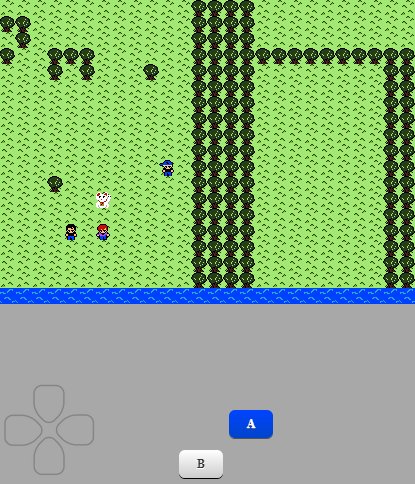

# RPG in JavaScript -> Enchant.js:

## Demo online:
https://gabrieldarezzo.github.io/rpg/

## Example Photo

## Objetivo:
Usar o `Enchant.js` e apartir das sprites:
   
   
Criar uma especie de RPG.

Provavelmente o `Enchant.js` como  ferramenta hoje já está obsoleta.
Mas as ideias de de gameLoop, Sprites, 
 
Recomendo dar uma olhada nessas libs:
 * https://phaser.io/  
 * http://www.melonjs.org/  

